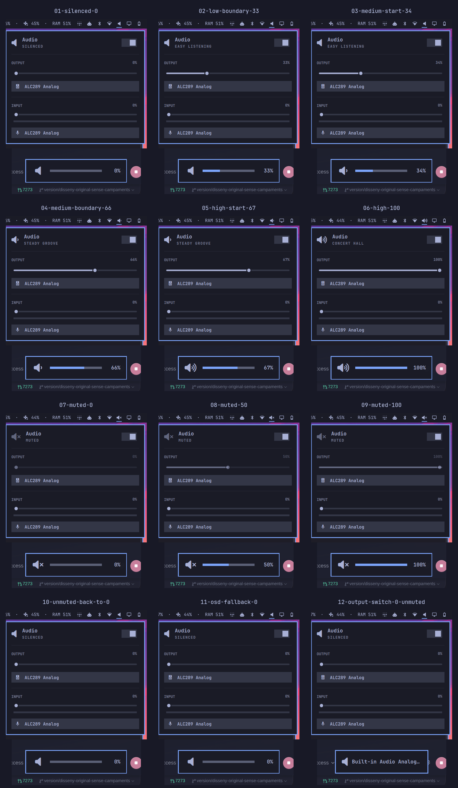

# Silenced vs muted at 0% — evidence for omarchy#7273

This branch contains the sanitized visual evidence and exact patch for the
follow-up proposed on [omacom/omarchy#7273](https://github.com/omacom/omarchy/pull/7273).
It is intentionally separate from the source branch so the implementation
stays reviewable and the media does not enter Omarchy's history.

The intended invariant is: **volume chooses the number of waves; only the real
mute flag chooses the cross**.

| State | Result |
|---|---|
| 0–33%, mute=no | low/bare speaker |
| 34–66%, mute=no | medium speaker |
| 67–100%, mute=no | high speaker |
| Any percentage, mute=yes | crossed speaker |

## Recordings

- [Volume-level boundaries: 0, 33, 34, 66, 67 and 100%](public-assets/01-volume-level-boundaries.mp4)
- [Silenced vs muted through the panel, media keys, OSD fallback and output-switch route](public-assets/02-silenced-vs-muted-all-routes.mp4)

## Reproducible code

- [Source branch](https://github.com/ignasiupc/omarchy/tree/fix/silenced-vs-muted)
- [Implementation commit](https://github.com/ignasiupc/omarchy/commit/47f0df09)
- [Exact patch](code/upstream-pr7273.patch)
- [SHA-256 checksums](CHECKSUMS.sha256)

The focused test suites pass with 9 volume-command assertions, 6
output-switch assertions and 15 OSD-model assertions. `git diff --check` and
the full CLI suite also pass. The full shell suite has four unrelated
environment/baseline failures that reproduce on the unchanged PR head.

Environment used for the visual capture: Omarchy 4.0.4-1, Hyprland 0.56.2,
Quickshell 0.3.1 and JetBrainsMono Nerd Font. Only one analog output was
available, so the output-switch route was exercised at 0%, but a real
two-device transition and headphones/HDMI/Bluetooth output could not be
recorded.
